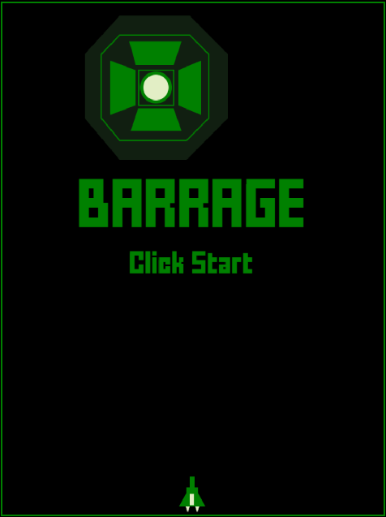

# BARRAGE 👾

Programming Shooting retoro mini game in Typescript

[](https://myurioka.github.io/barragewasm/)

[Play in browser](https://myurioka.github.io/barrage)

### How to play (Control)

-   Mouse move : Ship Moving
-   Mouse click : Operates & Shooting start / stop
-   Special mode: If you don't shoot for a while.

### Requirement

-   TypeScript, JavaScript

### How to Build & Run

```sh
$ cd barrage
$ ./node_module/.bin/tsc
$ npm start
```

Browse http://127.9.9.1:8080
